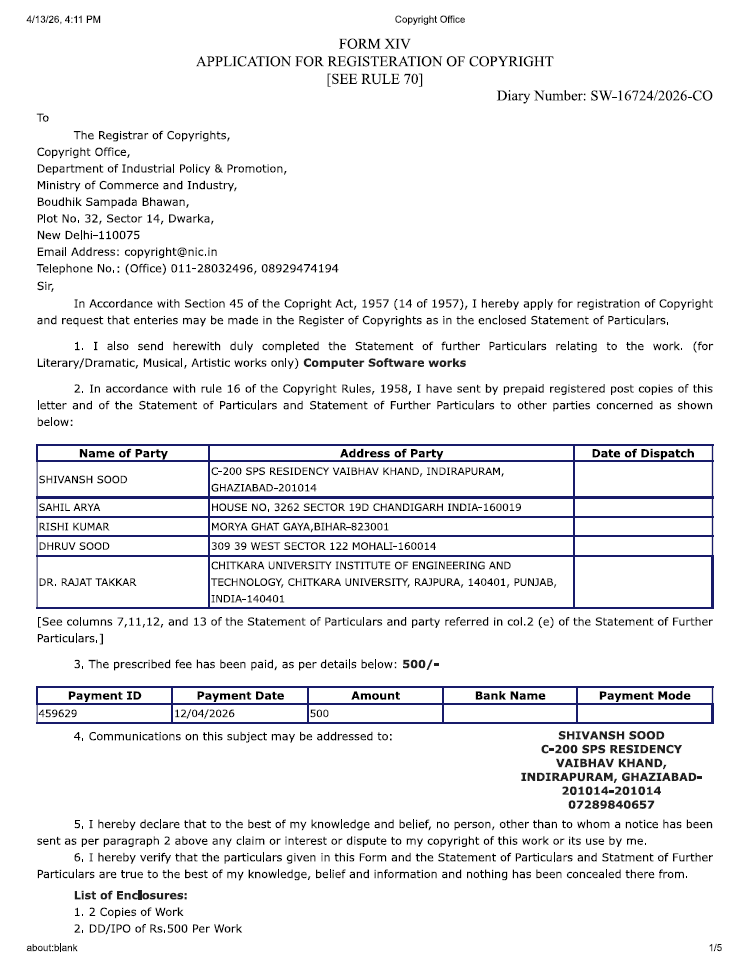

# Smart AI Cataloging Application (2210992328, 2210990757, 2210992161, 2210990279)

**School:** Chitkara University Institute of Engineering and Technology

---

## Team Details

| Name | Roll No |
|---|---|
| Shivansh Sood | 2210992328 |
| Sahil Arya | 2210990757 |
| Rishi Kumar | 2210992161 |
| Dhruv Sood | 2210990279 |

---

## Project Details

- **Project Title:** Smart AI Cataloging Application
- **Type:** Copyright
- **Current Status:** Submitted

---

## IPR Submission Proof

Copyright application submitted.



[View Copyright Application (PDF)](./Copyright_Application.pdf)

---

## Report and PPT

Report and presentation files are to be uploaded in this repository.

---

## Source Code

This repository contains the full source code for the Smart AI Cataloging Application, organized as follows:

- `api/` — Node.js backend with Gemini AI integration and MySQL database
- `client/` — React + Vite frontend with Tailwind CSS

### Running the project

**Backend:**
```bash
cd api
# Add your GEMINI_API_KEY to a .env file
docker-compose up -d
```

**Frontend:**
```bash
cd client
npm install
npm run dev
```
